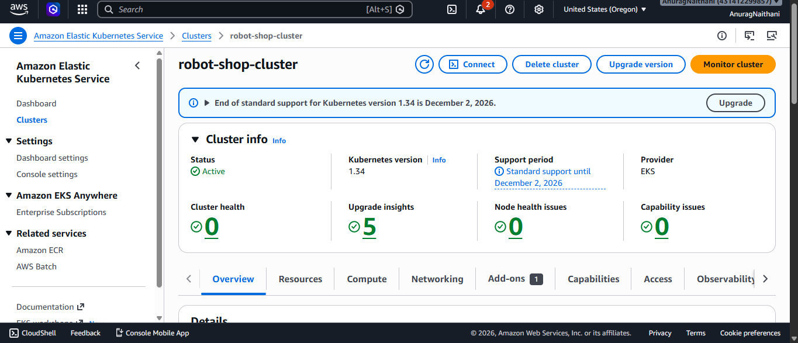
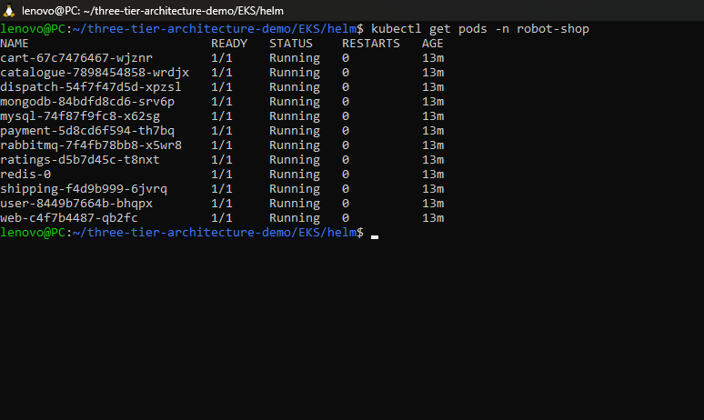
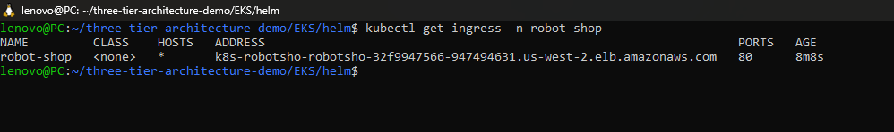
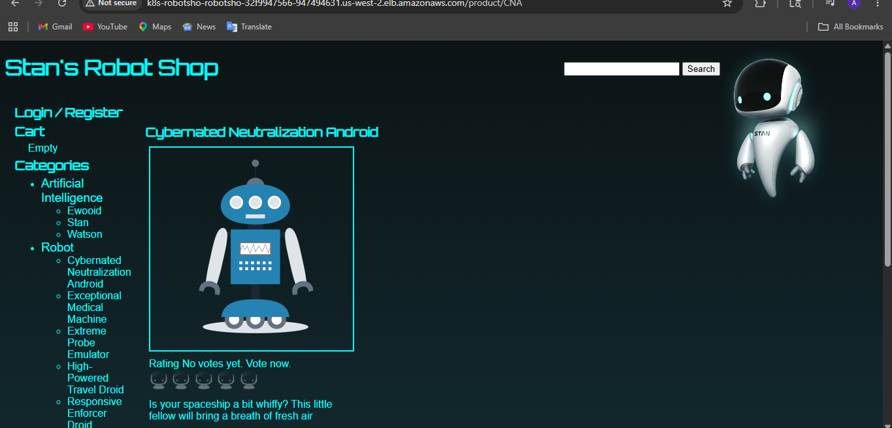
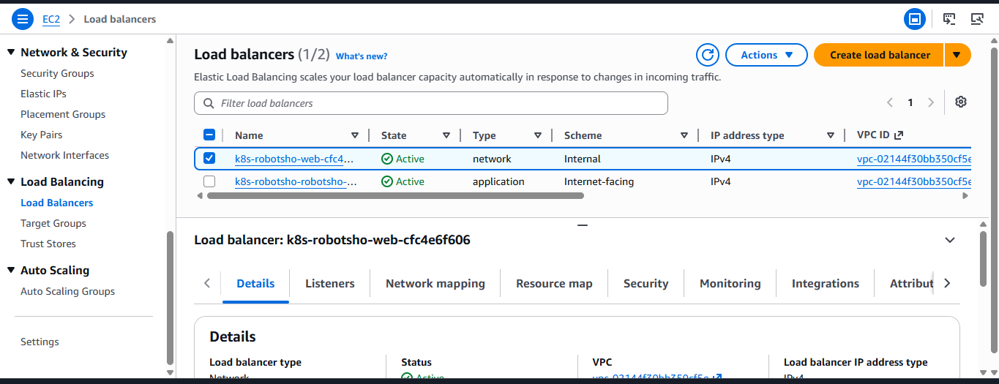

# AWS EKS Three-Tier E-Commerce Microservices Project

## Overview

This project demonstrates deployment of a production-grade three-tier e-commerce application on AWS EKS using Kubernetes, Helm, AWS Load Balancer Controller, and EBS CSI Driver.

The application follows a microservices architecture where frontend, backend services, databases, and messaging systems run inside Kubernetes pods on Amazon EKS.

---

# Project Architecture

```text
User / Browser
      ↓
AWS Application Load Balancer
      ↓
Kubernetes Ingress
      ↓
Web Frontend
      ↓
Backend Microservices
      ↓
MongoDB / MySQL / Redis / RabbitMQ
      ↓
Amazon EKS Cluster with EC2 Worker Nodes
```

---

# Three-Tier Architecture

## 1. Presentation Layer

The frontend UI is served using Nginx and AngularJS.

Responsibilities:

- User interaction
- Product display
- Cart access
- Checkout interface

---

## 2. Application Layer

Backend microservices handle business logic.

Services:

- Cart
- Catalogue
- User
- Payment
- Shipping
- Ratings
- Dispatch

---

## 3. Data Layer

Databases and supporting services store and process application data.

Components:

- MongoDB
- MySQL
- Redis
- RabbitMQ

---

# AWS Services Used

| AWS Service | Purpose |
|---|---|
| Amazon EKS | Kubernetes cluster |
| EC2 | Worker nodes |
| ALB | Public traffic |
| IAM OIDC | IAM integration |
| EBS CSI Driver | Persistent storage |
| CloudFormation | Infrastructure |
| VPC | Networking |

---

# Tools Used

- AWS CLI
- eksctl
- kubectl
- Helm
- Docker
- Kubernetes
- GitHub

---

# Deployment Steps

## Clone Repository

```bash
git clone https://github.com/anuragnaithani/aws-eks-three-tier-robot-shop.git
cd aws-eks-three-tier-robot-shop/EKS
```

---

## Create EKS Cluster

```bash
eksctl create cluster \
  --name robot-shop-cluster \
  --region us-west-2 \
  --nodegroup-name robot-shop-nodes \
  --node-type t3.medium \
  --nodes 2 \
  --managed
```

---

## Configure kubectl

```bash
aws eks update-kubeconfig \
  --region us-west-2 \
  --name robot-shop-cluster
```

---

## Install AWS Load Balancer Controller

```bash
helm repo add eks https://aws.github.io/eks-charts
helm repo update
```

---

## Deploy Application

```bash
kubectl create namespace robot-shop

cd helm

helm install robot-shop . -n robot-shop
```

---

# Deployment Proof

## EKS Cluster



---

## Pods Running



---

## Ingress ALB



---

## Application UI



---

## AWS Load Balancer



---

# Important Commands

```bash
kubectl get nodes

kubectl get pods -n robot-shop

kubectl get svc -n robot-shop

kubectl get ingress -n robot-shop
```

---

# Cleanup

```bash
eksctl delete cluster \
  --region us-west-2 \
  --name robot-shop-cluster
```

---

# What I Learned

- AWS EKS deployment
- Kubernetes microservices
- Helm deployment
- AWS ALB Ingress
- EBS CSI Driver
- Kubernetes networking
- Real-world DevOps workflow
- AWS cleanup and cost management

---

# Project Status

Completed Successfully ✅
